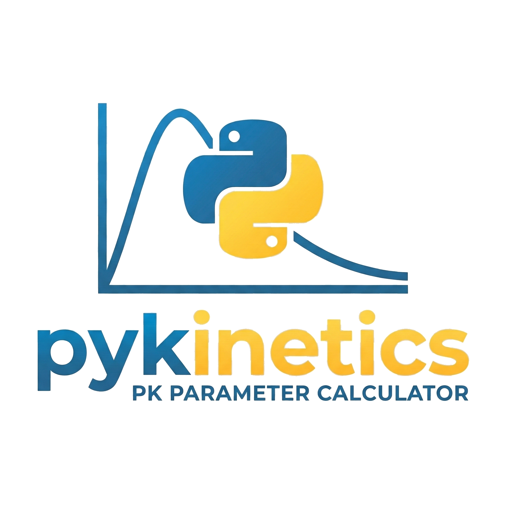

<div align="center">
  
  <h1>Pykinetics</h1>
  <p><strong>Advanced Pharmacokinetic Analysis & Modeling Web Application</strong></p>
</div>

---

## Overview

**Pykinetics** is a modern, responsive web application designed for comprehensive pharmacokinetic (PK) analysis. Built with Python (Flask) and a dynamic JavaScript frontend, it allows users to input concentration-time data and instantly receive detailed kinetic modeling, robust parameter calculations, and interactive visualizations.

## Key Features

### 1. Robust Kinetic Modeling
- **Zero, First, Second, and Third Order Reactions:** Automatically identifies the best-fit kinetic order using $R^2$ linear regressions against concentration, $ln(C)$, $1/C$, and $1/C^2$.
- **Compartmental Analysis:** Evaluates Akaike Information Criterion (AIC) to intelligently distinguish between **1-Compartment** and **2-Compartment** intravenous (IV) models.
- **Bi-Exponential Fits:** Calculates complex $A$, $\alpha$, $B$, and $\beta$ parameters alongside compartment rate constants ($K_{12}$, $K_{21}$, $K_{10}$) for 2-Compartment biphasic data.

### 2. Oral Drug Administration Support
- Distinct analytical routing for **IV Bolus** vs **Oral** administration.
- Explicit mapping for **Absorption Rate Constant ($K_a$)** modeling utilizing the Method of Residuals.
- Automated extraction of observed peak timing ($T_{max}$) and peak concentration ($C_{max}$).
- Extrapolates Apparent Volume of Distribution ($V_d/F$) and Apparent Clearance ($Cl/F$).

### 3. Explicit Multi-Compartment Input
- Provides dynamic GUI support to independently track **up to 4 separate compartments** simultaneously.
- Responsive, auto-scaling CSS grid data tables that effortlessly add or remove input columns based on the selected compartment count.

### 4. Advanced Visualization (Chart.js)
- Renders dual-panel, interactive scatter plots in both **Linear ($C$ vs $t$)** and **Logarithmic ($ln(C)$ vs $t$)** scales.
- Dynamically overlays sophisticated regression curves (Zero order, First order, bi-exponential sweeps, and Oral absorption phase shapes) matching the analyzed data.
- Plots multi-trace series automatically for explicit multi-compartment inputs, color-coded for clarity.

### 5. Premium Dark Theme UI
- Beautifully stylized interface leveraging "Glassmorphism", glowing neon badges, and fluid layout scaling. 
- Fully responsive across Desktop and Mobile form factors.
- Displays analysis output in pristine, easily readable property cards.

## Setup & Installation

1. **Clone the repository:**
```bash
git clone https://github.com/heyiamnotacoder/pykinetics.git
cd pykinetics
```

2. **Set up a Virtual Environment (Recommended):**
```bash
python3 -m venv venv
source venv/bin/activate
```

3. **Install Dependencies:**
```bash
pip install -r requirements.txt
```

4. **Launch the Application:**
```bash
python app.py
```
*The app will be available locally at `http://127.0.0.1:5001`.*

## Tech Stack
- **Backend:** Python 3, Flask, NumPy, SciPy (for optimized curve fitting & regression engines).
- **Frontend:** HTML5, CSS3 Grid/Flexbox alignments, Vanilla JavaScript, Chart.js.

---
*Created as an advanced pharmacological modeling tool.*
